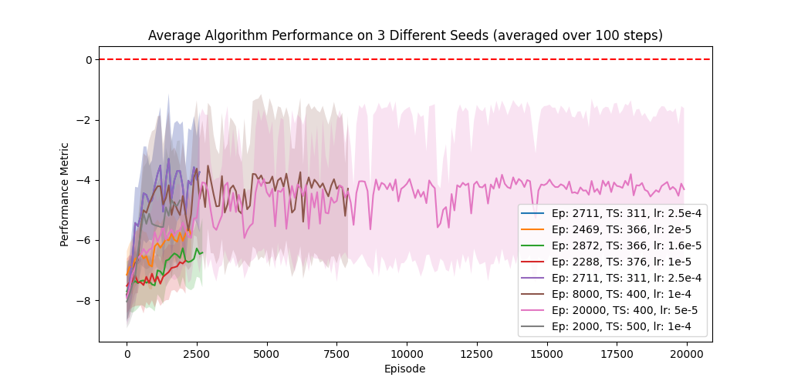
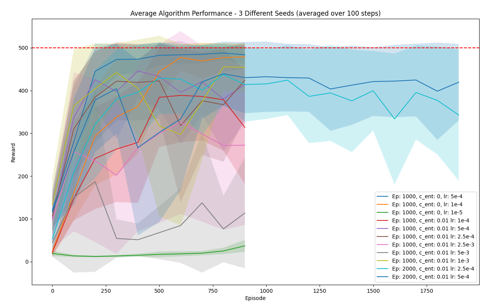

# Comparative Study of Deep Q-Network (DQN) and Proximal Policy Optimization (PPO) in OpenAI Gym Environments

## Project Overview

This repository contains the implementation of Proximal Policy Optimization (PPO) and Deep Q-Network (DQN) algorithms. The project aims to compare these two reinforcement learning algorithms based on their performance on the CartPole and Pendulum environments.

## Table of Contents

1. [Introduction](#introduction)
2. [Installation](#installation)
3. [Usage](#usage)
    - [PPO Usage](#ppo-usage)
    - [DQN Usage](#dqn-usage)
4. [Hyperparameter Tuning](#hyperparameter-tuning)
    - [PPO Hyperparameters](#ppo-hyperparameters)
    - [DQN Hyperparameters](#dqn-hyperparameters)
5. [Results](#results)
6. [References](#references)

## Introduction

This study focuses on the comparison and analysis of two reinforcement learning (RL) algorithms, Deep Q-Networks (DQN) and Proximal Policy Optimization (PPO), analyzed over OpenAI Gym environments CartPole and Pendulum, in which the former represents a discrete action space while the latter is a continuous environment.

DQN is a value-based method that utilizes a neural network to estimate the action-value function and make decisions according to the Q-values. PPO, on the other hand, is a policy-based method, meaning that it optimizes the policy directly using a clipped surrogate objective to ensure stable updates. Our objective is to compare and evaluate the performance of DQN and PPO on these environments.

## Installation

1. Clone the repository:
    ```sh
    git clone https://github.com/your-username/reinforcement-learning-project.git
    cd reinforcement-learning-project
    ```

2. Create a virtual environment and activate it:
    ```sh
    python -m venv venv
    source venv/bin/activate  # On Windows use `venv\Scripts\activate`
    ```

3. Install the required packages:
    ```sh
    pip install -r requirements.txt
    ```

## Usage

### PPO Usage

To train the PPO agent on CartPole-v1:
```python
train_multiple_seeds("cartpole1","CartPole-v1",seeds,1000,500,1e-4)
```

To visualize the trained PPO agent on Pendulum-v1:
```python
test_visualize_agent('models/ppo_model_Pendulum-v1_E_10000_TS_320_2024-05-30_06-54-50.pth', episodes=10000, max_timesteps=320, env_name='Pendulum-v1')
```

To load performances for each seed:
```python
perf1 = np.load("perf_metrics/2024-05-27_04-55-15_S_2_E_2711_TS_311_0.0002515289269330568_rewards.npy")
perf2 = np.load("perf_metrics/2024-05-27_04-30-15_S_0_E_2711_TS_311_0.0002515289269330568_rewards.npy")
perf3 = np.load("perf_metrics/2024-05-27_04-42-46_S_1_E_2711_TS_311_0.0002515289269330568_rewards.npy")
all_performances_1 = np.array([perf1, perf2, perf3])
data1 = ("rewards", all_performances_1, "Ep: 2711, TS: 311, lr: 2.5e-4", 2711, 311, 0.0002515289269330568)

perf4 = np.load("perf_metrics/2024-05-27_05-07-52_S_0_E_2469_TS_336_2.079508981715035e-05_rewards.npy")
perf5 = np.load("perf_metrics/2024-05-27_05-20-32_S_1_E_2469_TS_336_2.079508981715035e-05_rewards.npy")
perf6 = np.load("perf_metrics/2024-05-27_05-33-10_S_2_E_2469_TS_336_2.079508981715035e-05_rewards.npy")
all_performances_2 = np.array([perf4, perf5, perf6])
data2 = ("rewards", all_performances_2, "Ep: 2469, TS: 366, lr: 2e-5", 2469, 366, 2.0795089871175035e-05)

all_performances = [data1, data2]
plot_performances_multiple(all_performances)
```

### DQN Usage

(To be added later)

## Hyperparameter Tuning

### PPO Hyperparameters

- **Learning Rate (lr)**: The learning rate determines the step size during optimization. A smaller learning rate helps in achieving stable training. PPO Range: [\(1e^{-3}\), \(1e^{-5}\)]. Best value: \(5e^{-4}\)
- **Discount Factor (\(\gamma\))**: The discount factor helps in balancing immediate and future rewards. PPO Range: [0.95, 0.99]. Best value: 0.99
- **Epsilon Clip (\(\epsilon_{\text{clip}}\))**: The clip range for policy updates ensures the updates are not too drastic, maintaining stable training. PPO 0.2 is used
- **Entropy Coefficient (c_2)**: This coefficient helps in encouraging exploration by adding entropy to the loss function. PPO Range: [0, 0.02]. Best value: 0
- **Generalized Advantage Estimation (\(\lambda\))**: It helps in reducing variance and bias in advantage estimates. PPO Range: [0.9, 0.95]. Best value: 0.95
- **Number of Epochs (K)**: The number of epochs for updating the policy. PPO Range: [5, 10]. Best value: 10
- **Batch Size**: The batch size helps in managing the updates' granularity and stability. PPO Range: [32, 64]. Best value: 32
- **Timesteps per Episode**: The number of timesteps per episode determines the length of each trajectory. PPO Range: [200, 600]. Best value: 320
- **Number of Episodes**: The total number of episodes for training. PPO Range: [1000, 20000]. Best value: 4000

### DQN Hyperparameters

(To be added later)

## Results

### PPO on Pendulum-v1


*Figure: PPO Training Reward Comparison on Pendulum*

### DQN on CartPole-v1


*Figure: DQN Training Reward Comparison on CartPole*

## References

- Schulman et al., "Proximal Policy Optimization Algorithms", 2017.
- Mnih et al., "Human-level control through deep reinforcement learning", 2015.
```
